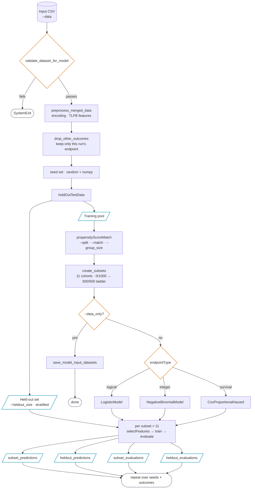

<div align="center">

# CTN-0094 ML Pipeline

**A modular, scalable pipeline for statistical modeling and fairness analysis on opioid use disorder treatment data.**

[](https://colab.research.google.com/drive/1Agj-EXE9WhLjMulA1mIVzW4YWNN7fiqX)
&nbsp;
[](https://ctn-0094.github.io/Pipeline/)
&nbsp;
[](https://github.com/CTN-0094/Pipeline/blob/main/LICENSE)
&nbsp;
[](https://ctnlibrary.org/protocol/ctn0094/)

</div>

---

## Overview

This project establishes a modular, reproducible data pipeline for statistical and machine learning modeling on the [CTN-0094](https://ctn-0094.github.io/Pipeline/) database. It supports multiple modeling strategies and evaluation metrics to study the relationship between patient demographics and opioid use disorder treatment outcomes — with a focus on algorithmic bias and fairness.

| | |
|---|---|
| **Clinical Lead** | Prof. Laura Brandt (City College of New York) |
| **Computational Lead** | Prof. Gabriel Odom |
| **Data Scientist** | Ganesh Jainarain |
| **Funding** | NIH AIM-AHEAD `1OT2OD032581-02-267` |

---

## Quick Start

```bash
python3 run_pipelineV2.py --data <path/to/data.csv> --outcome <outcome_name> [options]
```

Run `python3 run_pipelineV2.py --help` for all available arguments.

**Examples**

```bash
# Single outcome, single seed
python3 run_pipelineV2.py --data data.csv --outcome ctn0094_relapse_event -d ./results

# Loop through seeds 5–10 across all outcomes
python3 run_pipelineV2.py --data data.csv -l 5 10 -d ./results

# Loop through seeds with a subset of outcomes
python3 run_pipelineV2.py --data data.csv -l 5 10 -o ctn0094_relapse_event Ab_ling_1998 -d ./results

# Preprocess + PSM only — skip model training
python3 run_pipelineV2.py --data data.csv --outcome ctn0094_relapse_event --data_only -d ./results
```

---

## CLI Arguments

| Argument | Default | Description |
|:---|:---:|:---|
| `--data` | *(required)* | Path to cleaned input dataset (CSV) |
| `-o / --outcome` | all | Outcome(s) to run |
| `-l / --loop` | — | Min and max seed for multi-seed runs |
| `-d / --dir` | `""` | Output directory for logs, predictions, and evaluations |
| `--type` | — | Endpoint type for custom outcomes: `logical`, `integer`, `survival` |
| `--majority` | `1` | Value representing the majority group in the PSM column |
| `--split` | `RaceEth` | Column containing the two groups for PSM |
| `--match` | `age is_female` | Columns to match on during PSM |
| `--group_size` | `500` | Size of each PSM group (half the cohort size) |
| `--heldout_size` | `100` | Size of the held-out evaluation set |
| `--heldout_set_percent_majority` | `58` | Percent majority samples in the held-out set |
| `--data_only` | `False` | Save ML-ready datasets without running model training |
| `-p / --prof` | — | Profiling mode: `simple` or `complex` |

---

## Pipeline Architecture



Every path above runs once per `(outcome, seed)` pair. Two edges are easy to miss in a linear
reading: the **held-out set is carved out before matching**, so it never passes through PSM and
stays untouched until evaluation; and `--data_only` exits after cohort construction, before any
model is fit.

| Stage | What it does |
|:---|:---|
| **Validation** | Schema checks, column typing, endpoint-specific checks. Aborts the run on failure. |
| **Preprocessing** | Binary encoding, TLFB feature engineering, drops all outcome columns but this run's. |
| **Held-out split** | Stratified set held back before matching, shared by every subset's evaluation. |
| **PSM** | Splits majority/minority on `--split`, matches on `--match`, builds balanced cohorts. |
| **Subsets** | 11 cohorts of 1000, stepping minority representation from 0% to 50% in 5-point increments. |
| **Selection** | L1 regularization. Binary endpoints use a logistic L1; count and survival endpoints use a Lasso. Features with zero coefficients are dropped. |
| **Training** | Model chosen automatically by endpoint type — see below. |
| **Evaluation** | Scored twice per subset: on its own test split and on the shared held-out set. |

### How the Subsets Are Built

The subset ladder is the core of the fairness design, so it's worth stating precisely.

**1. Match.** Rows are split into majority (`--split` column equals `--majority`, i.e.
`RaceEth == 1`) and minority. R's `MatchIt` fits a probit-link propensity model on the
`--match` covariates (`age`, `is_female`) and runs **optimal 1:2 matching** over the first
`--group_size` (500) minority participants. That yields 500 **matched triples** — one
minority participant and two majority controls who resemble them on those covariates.

**2. Split into three aligned frames.** The triples become three 500-row frames,
`[minority, majority_A, majority_B]`, still aligned row-for-row: row *i* of each belongs to
the same triple.

**3. Walk the ladder.** Cohort *k* takes the first `k × 50` minority rows, majority_A from
`k × 50` onward, and all of majority_B. Each step therefore swaps 50 majority controls for
the 50 minority participants **they were matched to** — so age and sex balance holds while
racial composition shifts. majority_B is included in full every time, as a constant backbone.

| Cohort | 1 | 2 | 3 | 4 | 5 | 6 | 7 | 8 | 9 | 10 | 11 |
|:--|--:|--:|--:|--:|--:|--:|--:|--:|--:|--:|--:|
| **Minority** | 0 | 50 | 100 | 150 | 200 | 250 | 300 | 350 | 400 | 450 | 500 |
| **Majority** | 1000 | 950 | 900 | 850 | 800 | 750 | 700 | 650 | 600 | 550 | 500 |
| **Minority %** | 0% | 5% | 10% | 15% | 20% | 25% | 30% | 35% | 40% | 45% | 50% |

Every cohort totals 1000 rows, and the model is trained once per cohort — so a run produces
11 sets of metrics to read against this composition.

> **The ladder stops at 50/50.** It does not sweep to an all-minority cohort: because
> majority_B is always included in full, minority representation cannot exceed half.
> `--group_size` sets both the group size and the step (`group_size ÷ 10`); the rung count
> of 11 is fixed in `create_subsets` and not exposed on the CLI.

The held-out set is carved out *before* matching, keeps a fixed 58/42 majority ratio, and is
sampled with a fixed seed of 42 — so evaluation demographics stay constant across every
cohort and every run seed.

See [How It Works](https://ctn-0094.github.io/Pipeline/pipeline/) for the step-by-step version.

### Model Selection

| Endpoint Type | Model | Evaluation Metrics |
|:---|:---|:---|
| `logical` — binary | Logistic Regression (L1) | ROC-AUC, Precision, Recall, Confusion Matrix |
| `integer` — count | Negative Binomial Regression | MSE, RMSE, MAE, Pearson r, McFadden R² |
| `survival` — time-to-event | Cox Proportional Hazard | Concordance Index (C-statistic) |

> All evaluations include the demographic makeup of the training cohort for bias auditing.

---

## Available Outcomes

| Outcome | Endpoint Type |
|:---|:---:|
| `ctn0094_relapse_event` | Logical |
| `Ab_krupitskyA_2011` | Logical |
| `Ab_ling_1998` | Logical |
| `Rs_johnson_1992` | Logical |
| `Rs_krupitsky_2004` | Logical |
| `Rd_kostenB_1993` | Logical |
| `Ab_schottenfeldB_2008` | Integer |
| `Ab_mokri_2016` | Survival |

Custom outcomes can be passed with `-o <name> --type <logical|integer|survival>`.

---

## Project Structure

```
Pipeline/
├── run_pipelineV2.py              # Main entry point & CLI
├── src/
│   ├── constants.py               # EndpointType enum
│   ├── validate.py                # Dataset validation
│   ├── data_preprocessing.py      # Feature engineering
│   ├── preprocess_pipeline.py     # Preprocessing orchestration
│   ├── create_demodf_knn.py       # PSM & held-out set construction
│   ├── model_training.py          # Training + evaluation orchestration
│   ├── train_model.py             # Model classes (Logistic, NegBin, CoxPH, Beta)
│   ├── logging_setup.py           # Logging configuration
│   └── utils.py                   # Shared utilities
└── tests/                         # Unit tests
```

---

## Testing

```bash
pytest tests/
```

Test coverage includes input validation, model training, held-out splitting, data ingestion, and constants.

---

## References

Luo SX, Feaster DJ, Liu Y et al. **Individual-Level Risk Prediction of Return to Use During Opioid Use Disorder Treatment.** *JAMA Psychiatry.* 2024;81(1):45–56. [doi:10.1001/jamapsychiatry.2023.3596](https://jamanetwork.com/journals/jamapsychiatry/fullarticle/2810311)

> Multicenter decision-analytic prediction model using CTN trial data.