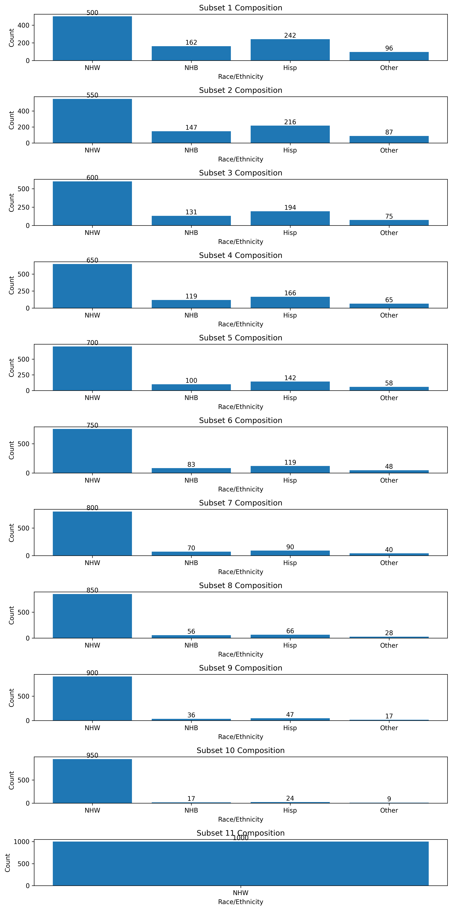

## Subset Composition Visualization

### Overview
This visualization represents the demographic composition of subsets created through an iterative process. Each subset contains a specified number of Non-Hispanic White (NHW) participants and minority participants. The process replaces a portion of the minority participants with NHW participants in each iteration using the K-Nearest Neighbors (KNN) algorithm.





### Key
- **NHW**: Non-Hispanic White
- **NHB**: Non-Hispanic Black
- **Hisp**: Hispanic
- **Other**: Other races or mixed
- **Refused/missing**: Handling missing values explicitly

### Subset Compositions
- **Subset 1**: 
  - 500 NHW
  - 162 NHB
  - 242 Hisp
  - 96 Other

- **Subset 2**:
  - 550 NHW
  - 147 NHB
  - 216 Hisp
  - 87 Other

- **Subset 3**:
  - 600 NHW
  - 131 NHB
  - 194 Hisp
  - 75 Other

- **Subset 4**:
  - 650 NHW
  - 119 NHB
  - 166 Hisp
  - 65 Other

- **Subset 5**:
  - 700 NHW
  - 100 NHB
  - 142 Hisp
  - 58 Other

- **Subset 6**:
  - 750 NHW
  - 83 NHB
  - 119 Hisp
  - 48 Other

- **Subset 7**:
  - 800 NHW
  - 70 NHB
  - 90 Hisp
  - 40 Other

- **Subset 8**:
  - 850 NHW
  - 56 NHB
  - 66 Hisp
  - 28 Other

- **Subset 9**:
  - 900 NHW
  - 36 NHB
  - 47 Hisp
  - 17 Other

- **Subset 10**:
  - 950 NHW
  - 17 NHB
  - 24 Hisp
  - 9 Other

- **Subset 11**:
  - 1000 NHW

### Explanation of the Subsetting Process

#### Initial Setup
1. **Import Libraries**:
    ```python
    import pandas as pd
    import numpy as np
    from sklearn.neighbors import NearestNeighbors
    ```

2. **Create Demographic Subsets**:
    ```python
    def create_demographic_dfs(data, initial_nhw=500, initial_minority=500, step=50):
        # Initialize lists and groups
        df_list = []
        minority_groups = data[data['RaceEth'] != 1]
        nhw_group = data[data['RaceEth'] == 1]
        
        # Sample initial participants
        initial_nhw_sample = nhw_group.sample(n=initial_nhw, random_state=42)
        initial_minority_sample = minority_groups.sample(n=initial_minority, random_state=42)
        
        current_nhw_sample = initial_nhw_sample.copy()
        remaining_minority_sample = initial_minority_sample.copy()
        
        current_nhw = initial_nhw
        current_minority = initial_minority
    ```

#### Iterative Subsetting
1. **Iteration Loop**:
    ```python
    while current_minority > 0:
        minority_sample = remaining_minority_sample.head(current_minority)
        
        if current_nhw > initial_nhw:
            knn = NearestNeighbors(n_neighbors=1)
            knn.fit(nhw_group[['age', 'is_female']])
            minority_features = remaining_minority_sample.head(step)[['age', 'is_female']]
            distances, indices = knn.kneighbors(minority_features)
            closest_nhw_indices = indices.flatten()
            additional_nhw_sample = nhw_group.iloc[closest_nhw_indices]
            current_nhw_sample = pd.concat([current_nhw_sample, additional_nhw_sample])
            nhw_group = nhw_group.drop(nhw_group.index[closest_nhw_indices])
        
        subset = pd.concat([current_nhw_sample, minority_sample])
        df_list.append(subset[['who', 'RaceEth', 'age', 'is_female']])
        
        current_nhw += step
        current_minority -= step

        if current_minority <= 0:
            current_minority = 0
            break

        remaining_minority_sample = remaining_minority_sample.head(current_minority)
    ```

#### Final Adjustment
1. **Ensure Final Subset**:
    ```python
    while current_nhw_sample.shape[0] < 1000:
        knn = NearestNeighbors(n_neighbors=1)
        knn.fit(nhw_group[['age', 'is_female']])
        distances, indices = knn.kneighbors(nhw_group[['age', 'is_female']].head(1))
        closest_nhw_indices = indices.flatten()
        additional_nhw_sample = nhw_group.iloc[closest_nhw_indices]
        current_nhw_sample = pd.concat([current_nhw_sample, additional_nhw_sample])
        current_nhw_sample = current_nhw_sample.drop_duplicates()
        nhw_group = nhw_group.drop(nhw_group.index[closest_nhw_indices])
    
    final_subset = current_nhw_sample.head(1000)
    df_list.append(final_subset[['who', 'RaceEth', 'age', 'is_female']])
    ```

2. **Return Subsets**:
    ```python
    return df_list
    ```

### Visual Explanation
Each subplot in the provided visualization represents one subset generated through the iterative process. Starting from the initial composition of 500 NHW and 500 minority participants, each subsequent subset replaces 50 minority participants with 50 NHW participants. The KNN algorithm is used to select NHW participants that are demographically similar (in terms of age and gender) to the minority participants being replaced.

This iterative replacement continues until the final subset, which contains 1000 NHW participants, demonstrating the gradual demographic shift in each iteration.

### Conclusion
The provided visualization and this README explain the composition and creation process of each demographic subset using the KNN algorithm and iterative replacement method. The subsets are carefully constructed to maintain demographic similarities between replaced participants, ensuring a robust analysis for each iteration.