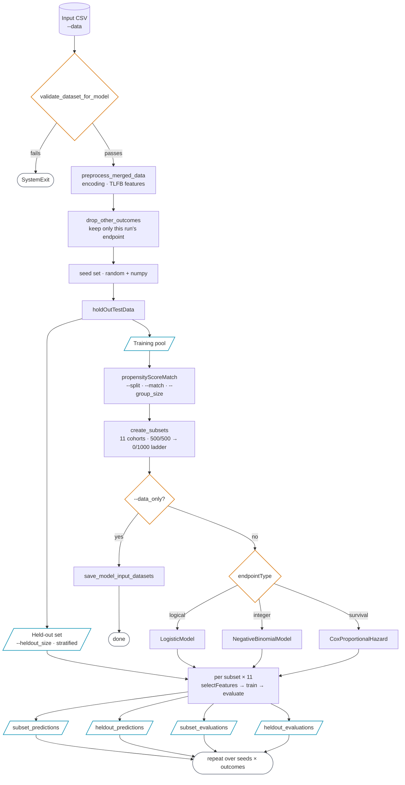

# How It Works

The DAB pipeline runs five main stages for each outcome and seed combination. They are mostly sequential, with two branches: the held-out set splits off before matching, and `--data_only` stops the run after cohort construction.

---

## Pipeline Overview

Every path above runs once per `(outcome, seed)` pair. Two edges are easy to miss in a
step-by-step reading:

!!! info "Structure worth noting"
    The **held-out set is carved out before matching**, so it never passes through PSM or the
    subset ladder and stays untouched until evaluation. And **`--data_only` exits after cohort
    construction**, before any model is fit.

---

## Step 1 — Validation & Preprocessing

The pipeline validates the input CSV against expected schemas before any modeling occurs. It checks:

- Required columns are present
- Target column values match the endpoint type (binary 0/1, non-negative integer, positive duration)
- No duplicate patient IDs

Feature engineering includes binary encoding of categorical variables and construction of Treatment Lifecycle Feedback (TLFB) features from weekly urine drug screening data.

---

## Step 2 — Propensity Score Matching (PSM)

PSM constructs a series of training cohorts with varying majority/minority demographic ratios. The pipeline uses R's `MatchIt` package (via `rpy2`) to perform optimal matching on age and sex.

11 cohorts are constructed, ranging from 100% majority to 100% minority composition, in 10% increments. This allows the evaluation step to measure how model performance shifts as demographic composition changes.

A stratified held-out evaluation set is constructed separately with a fixed majority/minority ratio (default: 58/42) to reflect the real-world distribution of the dataset.

---

## Step 3 — Feature Selection

L1 (Lasso) regularization is applied to automatically select predictive features before training. Features with zero coefficients after regularization are dropped. This reduces dimensionality and prevents overfitting on small cohorts.

!!! note
    If Lasso drops all features (over-regularization), the pipeline raises an error rather than silently training on no signal.

---

## Step 4 — Model Training

The model class is automatically selected based on the endpoint type of the chosen outcome:

| Endpoint Type | Model | Library |
|:---|:---|:---|
| `logical` — binary | Logistic Regression (L1) | scikit-learn |
| `integer` — count | Negative Binomial Regression | statsmodels |
| `survival` — time-to-event | Cox Proportional Hazard | lifelines |

Each model is trained independently on each PSM cohort.

---

## Step 5 — Evaluation

Each trained model is evaluated on two sets:

- **Internal test split** — 25% of the PSM cohort held out during training
- **Held-out set** — the fixed held-out set constructed in Step 2

Both evaluations record the demographic makeup of the training cohort alongside the metrics.

### Metrics by Endpoint Type

=== "Logical (binary)"

    | Metric | Description |
    |:---|:---|
    | ROC-AUC | Area under the receiver operating characteristic curve |
    | Precision | True positives / (true positives + false positives) |
    | Recall | True positives / (true positives + false negatives) |
    | Confusion Matrix | Full 2×2 breakdown |

=== "Integer (count)"

    | Metric | Description |
    |:---|:---|
    | MSE | Mean squared error |
    | RMSE | Root mean squared error |
    | MAE | Mean absolute error |
    | Pearson r | Linear correlation between predicted and actual |
    | McFadden R² | Goodness-of-fit relative to null model |

=== "Survival (time-to-event)"

    | Metric | Description |
    |:---|:---|
    | Concordance Index | C-statistic: probability model ranks a random pair correctly |

---

## Interpreting Results

The key question is: **does model performance change as the demographic composition of the training cohort changes?**

- **No change across ratios** → the outcome measure is *measurement invariant* — the model generalizes across groups equally
- **Performance drops as minority proportion increases** → the outcome is *measurement variant* — the model has learned patterns specific to the majority group

This framing is based on the measurement invariance framework from Odom et al. (2025).
