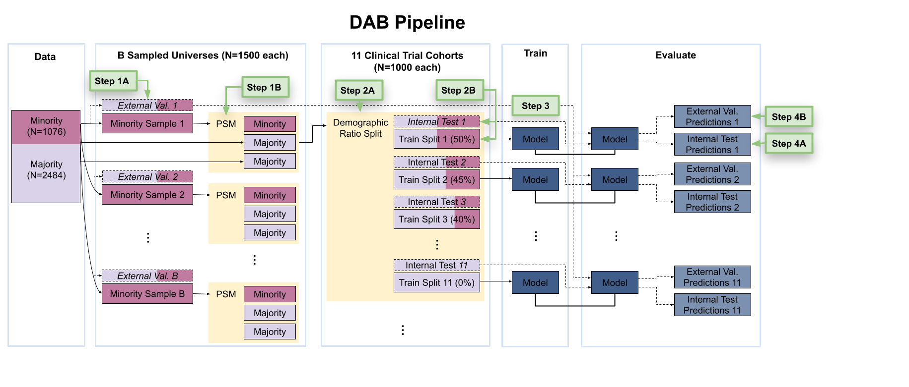

The Detecting Algorithmic Bias (DAB) Pipeline
=============================================

Overview
--------

The DAB pipeline is a codebase designed to evaluate bias in clinical trial data. It is constructed in a modular way, allowing the user to:

- Select an endpoint
- Import their own clinical data
- Train a model using existing or custom statistical methods

We define **algorithmic bias** as a disparity in model performance between different demographic groups.

Getting Started
---------------

Setting Up the Pipeline
-----------------------

Clone the pipeline repository into Google Colab:

.. code-block:: python

    import os
    if not os.path.exists("/content/Pipeline"):
        !git clone https://github.com/CTN-0094/Pipeline.git
        os.chdir("Pipeline")

Install all required packages:

.. code-block:: bash

    !pip install -r requirements.txt

Running the Pipeline
--------------------

Run the following command to execute the pipeline with default settings.

.. code-block:: bash

    !python run_pipelineV2.py --dir "/content/RESULTS"

Sample Console Output:

.. code-block:: none

    Elapsed time: 0.000638 seconds
    Available outcomes:
    1. ctn0094_relapse_event
    2. Ab_krupitskyA_2011
    3. Ab_ling_1998
    4. Rs_johnson_1992
    5. Rs_krupitsky_2004
    6. Rd_kostenB_1993
    Select an outcome by entering its number: 1

If you are prompted to install `MatchIt` or `optmatch`, select "1" (Yes).

.. code-block:: none

    MatchIt installed successfully.
    ✖ Would you like to install optmatch?
    1: Yes
    2: No

    Selection: 1

You have successfully run the pipeline! 🎉

Viewing the Results
-------------------

- On the left sidebar of Google Colab, click the **Files** tab
- Open the `RESULTS` directory
- Inside, go to the `evaluations` folder
- Open the most recent `.csv` file
- Each row = a demographic ratio split
- Rightmost columns = evaluation metrics

Understanding the Pipeline
--------------------------

The pipeline uses the **CTN-0094** dataset to model opioid use disorder outcomes. These outcomes are derived from urine drug screening data across multiple weeks.

Outcomes
~~~~~~~~

1. **ctn0094_relapse_event** — Any positive UDS
2. **Ab_krupitskyA_2011** — Confirmed abstinence (weeks 5–24)
3. **Ab_ling_1998** — Maintained 13 consecutive negative UDS (1 month)
4. **Rs_johnson_1992** — 2 consecutive positive UDS after 4-week treatment
5. **Rs_krupitsky_2004** — 3 consecutive positive UDS = relapse
6. **Rd_kostenB_1993** — 3 weeks of consecutive negative UDS

More info: https://ctn-0094.github.io/CTNote/

Pipeline Diagram
----------------

How the Pipeline Works
----------------------

**Step 1:** Hold out m validation samples and draw n “minority” + 2n matched “majority” samples.

**Step 2:** Form trial cohorts of 50/50 splits, then train/test on that and validate on held-out m.

**Step 3:** Train the specified model.

**Step 4:** Measure performance on test and validation samples.

Interpretation
~~~~~~~~~~~~~~

If model accuracy does **not change** across demographic compositions:

- ✅ Outcome is **measurement invariant**

If model accuracy **does change** across demographics:

- ❌ Outcome is **measurement variant**

Reference: Odom et al., 2025

Customizing the Pipeline
------------------------

The DAB pipeline is modular. You can swap out:

- Models
- Datasets
- Outcome definitions

However, user-defined dataset integration is not yet automated.
